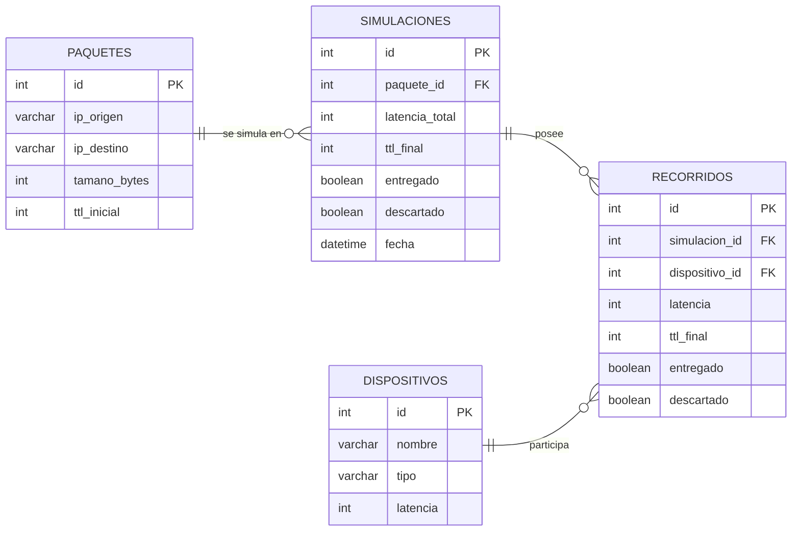

# Modelo Relacional - Datos en tránsito

```mermaid
erDiagram
    direction LR

    DISPOSITIVOS {
        int id PK
        varchar nombre
        varchar tipo
        int latencia
    }

    PAQUETES {
        int id PK
        varchar ip_origen
        varchar ip_destino
        int tamano_bytes
        int ttl_inicial
    }

    SIMULACIONES {
        int id PK
        int paquete_id FK
        int latencia_total
        int ttl_final
        boolean entregado
        boolean descartado
        datetime fecha
    }

    RECORRIDOS {
        int id PK
        int simulacion_id FK
        int dispositivo_id FK
        int latencia
        int ttl_final
        boolean entregado
        boolean descartado
    }

    PAQUETES ||--o{ SIMULACIONES : "se simula en"
    SIMULACIONES ||--o{ RECORRIDOS : posee
    DISPOSITIVOS ||--o{ RECORRIDOS : participa
```